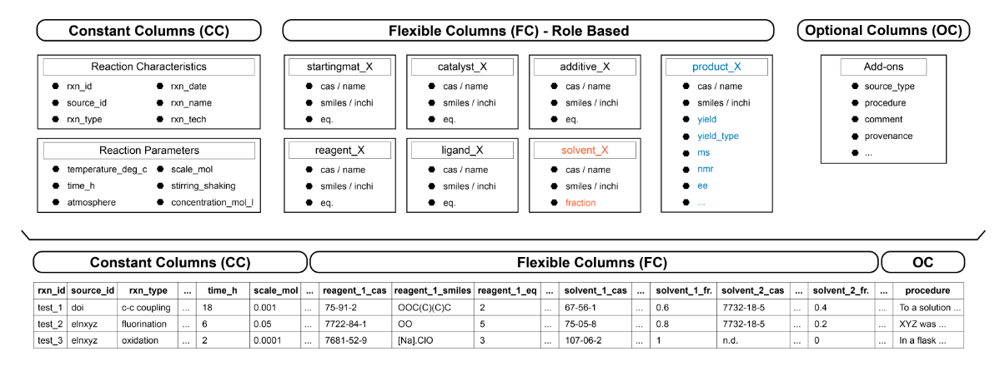

# Data resources

Our primary goal of this project is to enable the 'indexed' search of chemical reactions. This means that we want to be able to search for a reaction by its name, and retrieve the reaction conditions.
LLama2 has increased it's searcherable tokens to 4096 tokens, which means our indexes cannot be too large. We will need to be selective about the data we use to build our indexes.

## Dataset: Zenodo

### [Disconnection Labelled Reaction Data](https://zenodo.org/records/7101695)

[ChemArxiv 2022](https://chemrxiv.org/engage/chemrxiv/article-details/6328d0b8ba8a6d04fc551df7)

### PubChem
Rest API: https://pubchem.ncbi.nlm.nih.gov/docs/pug-rest#section=Input
Python API wrapper: https://pypi.org/project/pymed/
Full records: https://pubchem.ncbi.nlm.nih.gov/docs/pug-view#section=Record-Summaries

Developers help: https://www.ncbi.nlm.nih.gov/pmc/tools/developers/

### USPTO [download](https://figshare.com/articles/dataset/Chemical_reactions_from_US_patents_1976-Sep2016_/5104873/1)
Chemical reactions from US patents (1976-Sep2016)

Here, we only want to think about using 'application' data first. (or both grant and application data)
Reactions are stored in XML format, so we encode this in a dictionary format.

reactionList
|_ reaction
  |_ source
    |_ documentId
    |_ paragraphNum
    |_ paragraphText
  |_ productList
    |_ product
      |_ molecule
        |_ name
      |_ identifier (.find('identifier',dictRef="cml:smiles")["value"] / .find('identifier',dictRef="cml:inchi")["value"])
      |_ entryType
      |_ appearance
      |_ state
  |_ reactantList
    |_ reactant
      |_ molecule
        |_ name
      |_ identifier (.find('identifier',dictRef="cml:smiles")["value"] / .find('identifier',dictRef="cml:inchi")["value"])
      |_ entryType
  |_ spectatorList
    |_ spectator ["role"]
      |_ molecule
        |_ name
      |_ identifier (.find('identifier',dictRef="cml:smiles")["value"] / .find('identifier',dictRef="cml:inchi")["value"])
      |_ entryType
  |_ reactionActionList
    |_ reactionAction
      |_ phraseText
      |_ chemical

### example data structuring

